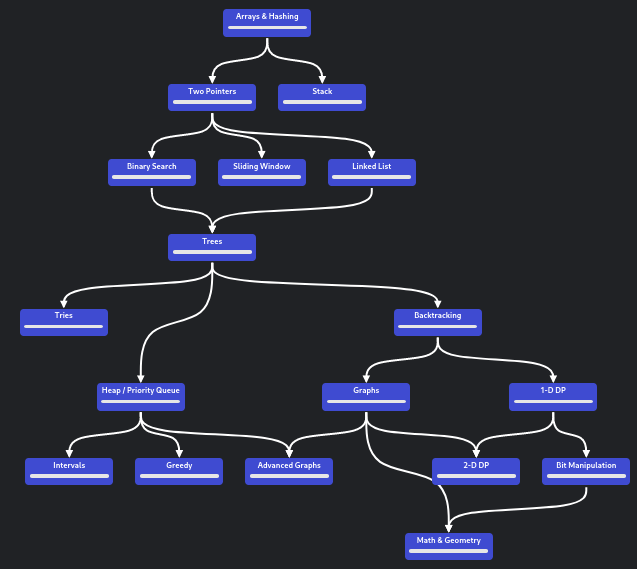

# LeetCode adventures

## Main principles 

1. Order matters
1. language somewhat matters (will use C++ to understand DS then use Python to solve problems)
1. 45mins - 1 hour max per question
1. Must explain reasoning when working
1. Solve 1-2 questions per day
1. Realize that at times only the solution (or God) will be able to help me with some questions
1. Note down tricks to solve questions
1. To ensure that I have grasped concepts:
    + Review solved questions
    + Review tricks to solve questions

## Roadmap (from [NeetCode](https://neetcode.io/roadmap))

## Data structures covered so far:
- [x] Arrays
- [ ] Stack
- [ ] LinkedList
- [ ] Trees
    - [ ] Tries
- [ ] Graphs
- [ ] Advanced graphs?

## Algorithms/techniques covered so far ft. (associated LeetCode problems):
- [ ] jaja
